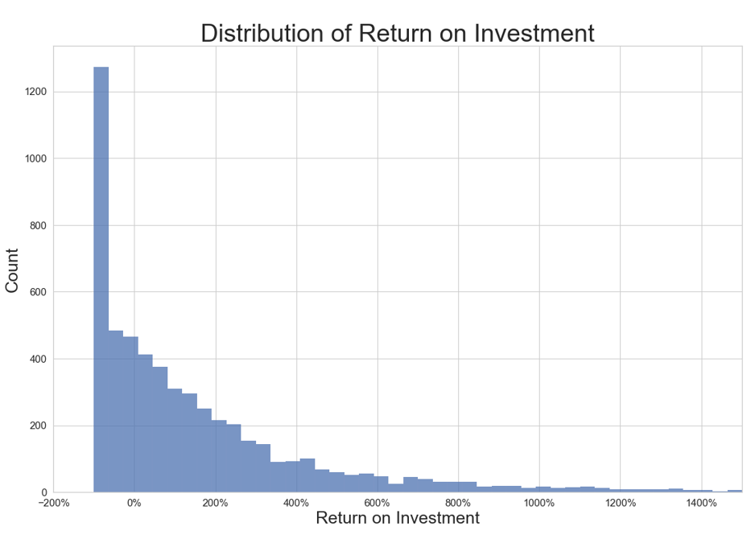
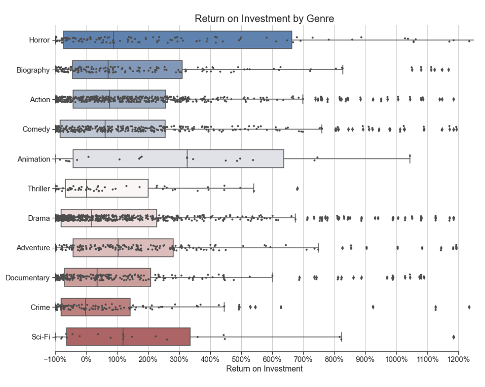
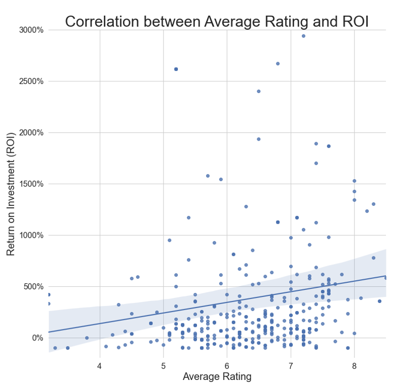
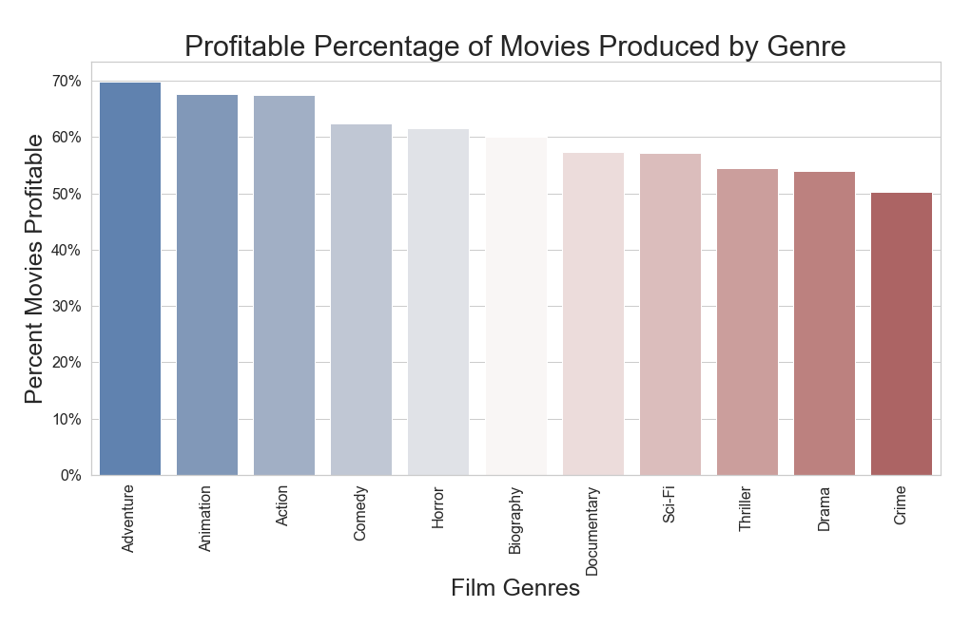
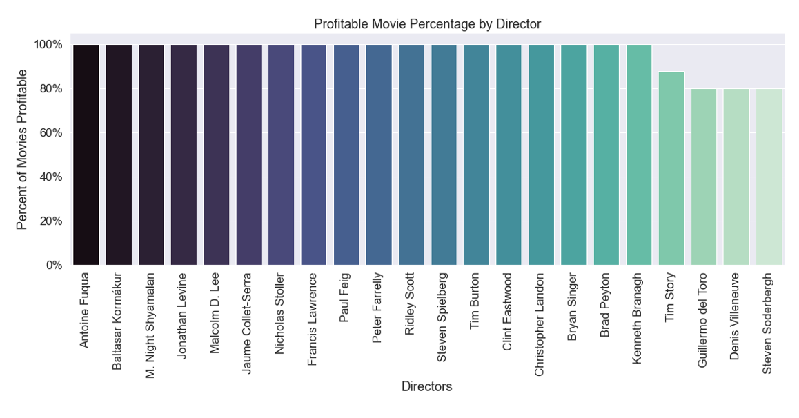

## Project Overview

For this project, I used exploratory data analysis to generate insights for a business stakeholder. The business problem is described below.

[Notebook PDF file] (travis_jup_notebook_p1.pdf)
[Notebook file] (/travis_jup_notebook.ipynb)
[Presentation File] (./Flatiron_P1_Presentation.pdf)

## Business Problem

Microsoft sees all the big companies creating original video content and they want to get in on the fun. They have decided to create a new movie studio, but they don’t know anything about creating movies. This analys explores what types of films are currently doing the best at the box office. This can be translated into actionable insights that the head of Microsoft's new movie studio can use to help decide what type of films to create.

## Data Understanding

The data provided is from the following sources:
- Box Office Mojo (https://www.boxofficemojo.com/) 
- IMDB (https://www.imdb.com/) 
- Rotten Tomatoes (https://www.rottentomatoes.com/) 
- TheMovieDB (https://www.themoviedb.org/)
- The Numbers (https://www.the-numbers.com/)

The data itself varies from source to source. IMDB data came in 9 different tables, accessible by SQL as a database. The other four sources all were either .csv or .tsv. 

The data included:
- Film revenues
- Genres
- Production Budgets
- Directors, writers, actors, and principals
- Film ratings and synopsis
- Film reviews

## Visualizations

## Conclusion
          
As previously stated, I believe Microsoft should be aiming to 1) make highly profitable movies, and 2) make movies that are relatively more likely to be profitable. 

If Microsoft is shooting for likelihood of profitability, they should focus on the five most consistantly profitable genres (in order): Adventure, Animation, Action, Comedy, and Horror. 

To improve the company's probability of profitability, I would suggest they hire one of the 22 directors from the "most profitable directors" list, which all have 1) made more than three movies in the past ten years, and 2) have made profitable movies over 75 percent of the time.

If Microsoft wants the best return on investment (ROI), they should consider making films in the following genres (in order): Animation, Adventure, Sci-Fi, Horror, Action.

If Microsoft wants the highest top-line revenue (i.e., worldwide gross), they should consider making films in the genres Adventure, Action, or Animation. 

Finally, if Microsoft wants to make highly-rated movies, they should consider making films in the genres (in order): Documentary, Biography, Drama, Adventure, Crime, Action, or Comedy. 

To consider multiple factors in the decision, the company should focus on Adventure, Animation, and Action, which all score highly in almost all of the categories considered. They should further look to hire one of the 22 directors on the list of most consistantly profitable directors. 

